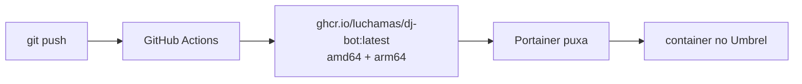

# 🎧 DJ Bot

Bot de música para Discord com comandos de barra, que entende **links do YouTube e do Spotify** —
além de busca por texto. Roda direto no Node ou em Docker, e foi feito para viver 24/7 num servidor
Umbrel.

## Como funciona

| Fonte | O que é aceito | Como toca |
| --- | --- | --- |
| YouTube | vídeo, playlist, Shorts, YouTube Music | áudio extraído direto pelo `yt-dlp` |
| Spotify | faixa, álbum, playlist, artista | metadados pela API do Spotify → áudio equivalente no YouTube |
| Texto | `/play engenheiros do hawaii infinita highway` | busca no YouTube |
| Outros | SoundCloud, Bandcamp, Twitch VOD, ... | qualquer site suportado pelo `yt-dlp` |

> A API do Spotify **não** permite streaming de áudio por bots — ela só entrega metadados. Por isso o
> bot lê título e artista do link e reproduz a versão correspondente do YouTube. É o mesmo caminho
> usado por praticamente todos os bots de música.

Faixas do Spotify são resolvidas no YouTube **só na hora de tocar**, e não quando entram na fila —
assim uma playlist de 200 músicas é enfileirada em segundos em vez de minutos.

## Comandos

| Comando | Descrição |
| --- | --- |
| `/play <busca> [proxima]` | Toca ou enfileira um link/termo de busca |
| `/skip [quantidade]` | Pula a faixa atual (ou várias) |
| `/pause` · `/resume` | Pausa e retoma |
| `/stop` | Para tudo e limpa a fila |
| `/queue [pagina]` | Mostra a fila |
| `/nowplaying` | Faixa atual com barra de progresso |
| `/volume [nivel]` | Consulta ou ajusta o volume (0–200%) |
| `/loop <modo>` | Repetição: desligado / faixa / fila |
| `/shuffle` | Embaralha a fila |
| `/remove <posicao>` | Remove uma faixa da fila |
| `/clear` | Limpa a fila sem parar a faixa atual |
| `/leave` | Sai do canal de voz |
| `/help` | Lista os comandos |

---

# Parte 1 — Rodando na sua máquina

## Pré-requisitos

- **Node.js 22.x**. Funciona da 20.11 pra cima, mas a 22 é a recomendada: é a versão mais nova com
  binário pronto do `@discordjs/opus` (o encoder de áudio nativo). Da 24 em diante o npm tenta
  compilá-lo do zero, o que exige o compilador C++ do Visual Studio.

  ```bash
  winget install OpenJS.NodeJS.LTS --version 22.23.2
  ```

  Se o winget não listar mais a 22.x, baixe o MSI em
  <https://nodejs.org/dist/v22.23.2/node-v22.23.2-x64.msi>. Feche e reabra o terminal depois.

- **FFmpeg não precisa ser instalado** — vem no pacote `ffmpeg-static`.
- **yt-dlp não precisa ser instalado** — o `npm install` baixa o executável para `./bin`.

## Instalação

```bash
npm install
```

```bash
copy .env.example .env
```

### 1. Credenciais do Discord (obrigatório)

1. Acesse <https://discord.com/developers/applications> → **New Application**.
2. Aba **Bot** → **Reset Token** → copie para `DISCORD_TOKEN`.
3. Aba **General Information** → copie o **Application ID** para `DISCORD_CLIENT_ID`.
4. Coloque o ID do seu servidor em `DISCORD_GUILD_ID` (ative o Modo Desenvolvedor no Discord, clique
   com o botão direito no servidor → *Copiar ID*). Isso faz os comandos aparecerem na hora; sem isso
   o registro é global e leva até 1 hora.

Nenhuma *Privileged Gateway Intent* é necessária.

### 2. Credenciais do Spotify (opcional, recomendado)

1. Acesse <https://developer.spotify.com/dashboard> → **Create app** (qualquer nome; a Redirect URI
   pode ser `http://localhost:3000`, não é usada).
2. Copie **Client ID** e **Client Secret** para `SPOTIFY_CLIENT_ID` / `SPOTIFY_CLIENT_SECRET`.

Sem essas credenciais só funcionam links de **faixa única** do Spotify (via oEmbed); álbuns,
playlists e artistas exigem a API.

### 3. Convidar o bot

Aba **OAuth2 → URL Generator**: marque os escopos `bot` e `applications.commands`, e as permissões
**View Channel**, **Send Messages**, **Embed Links**, **Connect** e **Speak**. Abra a URL gerada e
escolha o servidor.

## Uso

```bash
npm run deploy
```

```bash
npm start
```

O `npm run deploy` registra os comandos de barra e só precisa rodar de novo quando você adicionar ou
alterar comandos.

## Verificar se está tudo funcionando

```bash
npm run smoke
```

Testa a cadeia inteira sem conectar no Discord: encoder de opus, montagem do texto de presence,
yt-dlp, resolvers de link, embeds e o pipeline de áudio até receber PCM de verdade. É o primeiro
lugar a olhar quando algo parar de tocar.

---

# Parte 2 — A estrutura Docker

## Os três arquivos, e por que são três

| Arquivo | Papel | Tem `build:`? |
| --- | --- | --- |
| `Dockerfile` | receita da imagem — usado por todos os caminhos | — |
| `docker-compose.yml` | subir **por SSH**, construindo a imagem na hora | sim |
| `portainer-stack.yml` | subir **pelo Portainer**, com imagem já publicada | não |

A duplicação não é preguiça: ela existe porque **o Portainer não constrói imagem a partir de um
`Dockerfile`** — nem pelo editor web, nem apontando para um repositório Git. Um compose com `build:`
falha com `Cannot locate specified Dockerfile`.

Some-se a isso que o `docker-compose.yml` usa `env_file: .env`, e a pasta que o Portainer cria para a
stack não tem `.env` nenhum. Daí o erro clássico:

```
failed to resolve services environment: env file /data/compose/NN/.env not found
```

Por isso o `portainer-stack.yml` existe: sem `build:`, e com as variáveis declaradas uma a uma em
`environment:`, preenchidas pela tela do Portainer.

> ⚠️ No modo Repository do Portainer, o campo **Compose path** vem preenchido com `docker-compose.yml`.
> **Troque para `portainer-stack.yml`** — não trocar é o que causa o erro acima.

## O que tem dentro da imagem

```
node:22-bookworm-slim
├─ /app/src          código do bot
├─ /app/scripts      instalador do yt-dlp
├─ /app/node_modules dependências, incluindo o ffmpeg do ffmpeg-static
└─ /app/bin/yt-dlp   binário baixado durante a build  ←  volume nomeado
```

Três decisões que valem explicar:

**Node 22 e não a mais recente.** Mesma razão do pré-requisito local: é a última versão com binário
pronto do `@discordjs/opus`. Os prebuilds cobrem `linux/amd64` e `linux/arm64`, glibc e musl — então
o encoder nativo funciona inclusive no Raspberry Pi. Se ainda assim falhar, ele está em
`optionalDependencies` e o bot cai sozinho no `opusscript`.

**Debian e não Alpine.** Os binários do `ffmpeg-static` e do `yt-dlp` são ligados à glibc e
simplesmente não rodam sobre a musl do Alpine. A imagem fica maior, mas funciona.

**`/app/bin` é volume nomeado.** Assim `npm run ytdlp:update` sobrevive à recriação do container —
importante porque o YouTube quebra a extração com frequência e essa é a correção mais comum. Na
primeira subida o Docker semeia o volume com o binário que veio na imagem. Volume nomeado também é o
que o Umbrel recomenda para containers customizados: dados em bind mount se perdem quando o app
Portainer é atualizado.

Além disso: **nenhuma porta é exposta** (o bot só abre conexões de saída para o Discord, então não
há o que conflitar com os apps do Umbrel nem o que liberar no roteador), o log é rotacionado em
3 arquivos de 10 MB (no Pi ele vai para o cartão SD), e o `.dockerignore` exclui o `.env` — o token
entra só em runtime, nunca fica gravado na imagem.

## Como a imagem chega no servidor

O GitHub Actions constrói e publica no GHCR a cada push no `main`, para as duas arquiteturas:



O workflow está em `.github/workflows/docker-publish.yml` e usa o `GITHUB_TOKEN` automático — não é
preciso criar nenhum segredo.

Um detalhe que quebra builds silenciosamente: **o Docker não aceita maiúscula em nome de imagem**, e
o repositório se chama `Luchamas/DJ-Bot`. O workflow converte o nome antes de publicar, e é por isso
que a imagem final é `ghcr.io/luchamas/dj-bot`, toda minúscula.

---

# Parte 3 — Hospedando no Umbrel

Dois caminhos. O **A** é o recomendado: depois de configurado, atualizar o bot é só um `git push`.

## Caminho A — Portainer + GHCR (sem SSH)

### 1. Publicar no GitHub

```bash
git add -A && git commit -m "Deploy" && git push
```

O `.env` está no `.gitignore` e não vai junto.

### 2. Esperar o Actions

Aba **Actions** no GitHub. O primeiro build leva ~10 minutos porque a variante ARM roda emulada por
QEMU. Se você já sabe a arquitetura do seu Umbrel, apague a outra da linha `platforms:` do workflow e
o tempo cai pela metade.

### 3. Liberar o acesso à imagem

Pacotes do GHCR nascem privados. O mais simples é abrir: perfil do GitHub → **Packages** → `dj-bot` →
**Package settings** → **Change visibility** → *Public*. A imagem não contém segredo algum.

Se preferir mantê-lo privado, cadastre em **Registries → Add registry → Custom** no Portainer, com
URL `ghcr.io`, seu usuário e um Personal Access Token com escopo `read:packages`.

### 4. Criar a stack

Portainer → **Stacks → Add stack → Repository**:

| Campo | Valor |
| --- | --- |
| Repository URL | `https://github.com/Luchamas/DJ-Bot` |
| Repository reference | `refs/heads/main` |
| Compose path | `portainer-stack.yml` ⚠️ **não deixe o padrão** |

Em **Environment variables**, adicione no mínimo:

| Nome | Valor |
| --- | --- |
| `DISCORD_TOKEN` | o token do bot |
| `DISCORD_CLIENT_ID` | o Application ID |
| `DISCORD_GUILD_ID` | o ID do servidor (opcional, mas recomendado) |
| `SPOTIFY_CLIENT_ID` | opcional |
| `SPOTIFY_CLIENT_SECRET` | opcional |

As demais variáveis do arquivo têm padrão embutido. **Deploy the stack**.

Se preferir colar o YAML na mão, use **Web editor** com o conteúdo do `portainer-stack.yml`.

### 5. Registrar os comandos de barra

Uma única vez, com o container já rodando — ele reaproveita as variáveis do Portainer, então você não
digita o token de novo. Containers → `dj-bot` → **Console** → conectar como `node`:

```bash
npm run deploy
```

### 6. Conferir

Containers → `dj-bot` → **Logs**. Deve aparecer `🎧 Conectado como SeuBot#1234`.

## Caminho B — SSH direto

Sem GitHub, sem Portainer. O bot fica independente de qualquer app do Umbrel.

```bash
ssh umbrel@umbrel.local "mkdir -p ~/dj-bot"
```

```bash
scp -r Dockerfile docker-compose.yml package.json package-lock.json src scripts umbrel@umbrel.local:~/dj-bot/
```

Depois, dentro do SSH, crie o `.env` com `nano ~/dj-bot/.env` (cole o conteúdo do seu `.env` local),
proteja com `chmod 600 ~/dj-bot/.env`, e suba:

```bash
cd ~/dj-bot && docker compose up -d --build
```

Registre os comandos uma vez:

```bash
cd ~/dj-bot && docker compose exec dj-bot npm run deploy
```

## Operação

| O quê | Portainer | SSH |
| --- | --- | --- |
| Ver log | Containers → `dj-bot` → Logs | `docker compose logs -f` |
| Reiniciar | Containers → `dj-bot` → Restart | `docker compose restart` |
| Mudar variável | Stacks → Editor → Update | editar `.env` e `docker compose up -d` |
| Atualizar yt-dlp | Console → `npm run ytdlp:update` | `docker compose exec dj-bot npm run ytdlp:update` |
| Diagnóstico | Console → `npm run smoke` | `docker compose exec dj-bot npm run smoke` |
| Publicar código novo | `git push`, depois Update the stack com *Re-pull image* | `docker compose up -d --build` |

Com `restart: unless-stopped`, o bot volta sozinho depois de reboot do Umbrel ou queda de luz.

## O que esperar do hardware

O trabalho pesado é o `yt-dlp` baixando e o `ffmpeg` convertendo para PCM — um par de processos por
faixa tocando. Raspberry Pi 4/5 dá conta de 1–2 servidores simultâneos; Umbrel Home ou mini PC x86
sobra folga.

---

# Referência

## Status do bot (presence)

Enquanto toca, o bot aparece como **"Ouvindo &lt;música&gt; • 3:20/6:13"** na lista de membros.
Pausado vira `⏸️`, transmissão ao vivo vira `🔴 ao vivo`, e com vários servidores tocando ao mesmo
tempo mostra `🎵 N servidores tocando` — a presence é uma só para o bot inteiro, então exibir uma
faixa específica enganaria quem está ouvindo outra coisa.

O tempo **não anda sozinho**: a API do Discord só aceita `name`, `type`, `state` e `url` na presence
de um bot. O campo `timestamps`, que faz o cronômetro correr no Rich Presence de usuário, é ignorado
para bots. Por isso o texto é reescrito periodicamente — a cada 15 s por padrão, bem abaixo do limite
do gateway de 5 atualizações a cada 20 s. Ajuste em `PRESENCE_UPDATE_SECONDS`, mude o texto de
ocioso em `PRESENCE_IDLE_TEXT`, ou desligue com `PRESENCE_ENABLED=false`.

## Estrutura do código

```
src/
├─ index.js              # cliente, eventos, tratamento de erros
├─ deploy-commands.js    # registro dos comandos de barra
├─ config.js             # leitura e validação do .env
├─ commands/             # um arquivo por comando (data + execute)
└─ lib/
   ├─ ytdlp.js           # wrapper do yt-dlp + pipeline yt-dlp → ffmpeg → PCM
   ├─ spotify.js         # API do Spotify (client credentials) + fallback oEmbed
   ├─ resolver.js        # link/busca → lista de faixas; Spotify → YouTube
   ├─ queue.js           # fila e player por servidor
   ├─ presence.js        # status do bot com a faixa e o tempo
   ├─ bus.js             # eventos internos (fila → presence)
   ├─ guards.js          # validações (canal de voz, permissões)
   ├─ embeds.js          # mensagens visuais
   └─ format.js          # duração, barra de progresso, links
```

## Solução de problemas

**Portainer: `env file /data/compose/NN/.env not found`**

O **Compose path** da stack está apontando para `docker-compose.yml` (o padrão do campo). Troque para
`portainer-stack.yml`.

**Portainer: `No such image: dj-bot:latest`**

A stack está pedindo uma imagem local que não existe. Ou o Actions ainda não publicou no GHCR, ou o
`image:` foi trocado para a variante local sem que a imagem fosse construída no servidor.

**`yt-dlp nao encontrado`**

```bash
npm run ytdlp:update
```

**Vídeos param de tocar do nada**

O YouTube muda a extração com frequência. Atualize o yt-dlp com o comando acima. O `npm run smoke`
confirma se voltou.

**YouTube pedindo login ("Sign in to confirm you're not a bot")**

Mais comum em IP de datacenter/VPS. Configure cookies no `.env`: `YTDLP_COOKIES_FROM_BROWSER=chrome`
(com o navegador fechado) ou `YTDLP_COOKIES=C:\caminho\cookies.txt`.

**`npm install` falhando em `@discordjs/opus` com `gyp ERR! find VS`**

O `@discordjs/opus` é o encoder nativo, mais rápido. Ele só publica binários prontos até o Node 22
(ABI 127); em versões mais novas o npm cai para compilar do zero, o que exige a workload
"Desenvolvimento para desktop com C++" do Visual Studio.

Ele está em `optionalDependencies`, então **essa falha não derruba o `npm install`** — o
`prism-media` cai automaticamente no `opusscript`, JavaScript puro que funciona em qualquer lugar. O
bot toca normalmente assim; a diferença aparece só com muitos servidores simultâneos.

Para ter o nativo: use o Node 22, ou instale a workload C++ e rode `npm install @discordjs/opus`. A
etapa `[3] encoder de opus` do `npm run smoke` diz qual está ativo.

**Playlist do Spotify devolvendo "não encontrado ou privado"**

Playlists editoriais do próprio Spotify (IDs começando em `37i9dQ`) são bloqueadas pela API desde
novembro de 2024 e respondem 404 para aplicativos novos. Playlists criadas por usuários funcionam.

**Ver o relatório de dependências de voz**

```bash
node src/index.js --deps
```
